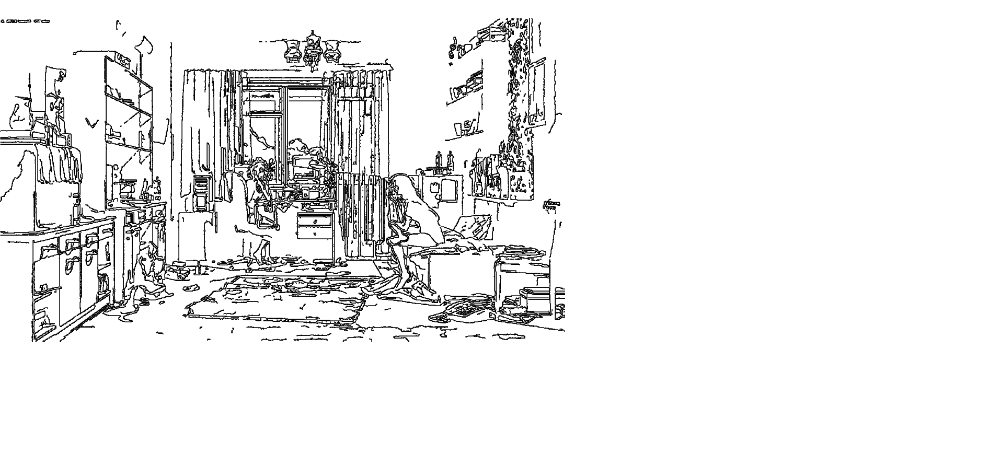
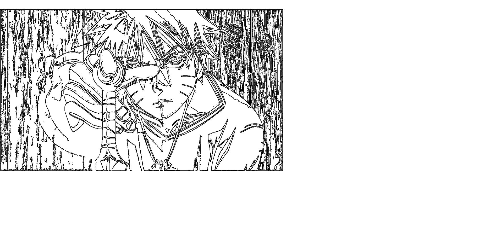

# AutoDraw

AutoDraw is a GUI Application build using python. It's purpose decide to clear out noise from the photo, take photo using webcam and draw a sketch of it or save it. Choice is yours.

## Working:
Picture processing is done with the help of OpenCV module, drawing is done using OpenCV and PyAutoGUI in following way:
- Converting photo into gray
- Removing noise from it 
- Taking its edges (canny)
- Using PyAutoGUI drawing row-wise.

## Use:
You may be wondoring, what is the use of this application? Well it can be used to replace drawing detailed item by automating it or just helping the artist draw the curve He/She is unable to.

Grab a cup of coffee and Relax

## ScreenShots
_**I do not own this photos**_

Original

Drawn

Original

Drawn

Drawing whole photo takes a lot of time, So Go outside and Do some other work.

This photos were found on this [site](https://wall.alphacoders.com) .

## Modules Required
 - numpy
 - pyautogui
 - keyboard
- opencv
- pillow
- sys
- tkinter

